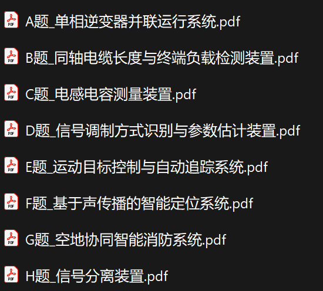
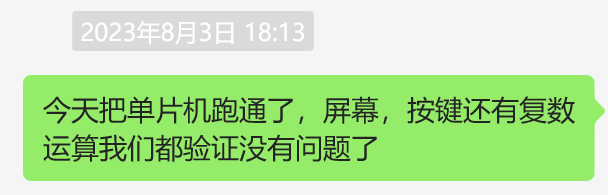
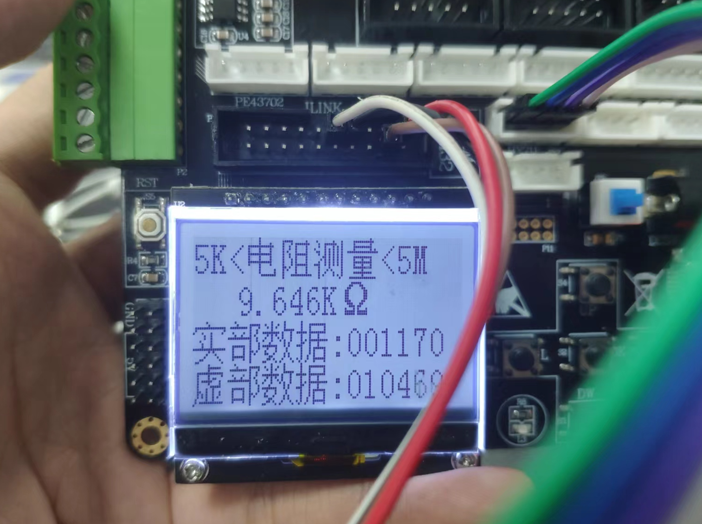

# 电赛经历 及2023年B题资料 同轴电缆长度与终端负载检测装置（updating

Tips:23年及历年的题目放到“搜罗过资料”文件夹了，程序啊什么的也有自取，如果愿意看看我的经历就再好不过了，谢谢谢谢。

这里记录一下当时电赛做出来的小东西，经过这次比赛，我深刻认识了自己有多菜。不过好在借此机会锻炼了一些写代码的能力，受到了老师倾心的指导，对我的帮助是全方面的，如果我的专业能力还能再强一些就好了555。

## 赛前准备

先得知道这是一个比什么的比赛吧，当时我们小组三个人都是第一次接触这个比赛，完全不是抱着拿奖的心态来的。这类比赛学校基本会报销所有产生的费用（当然也有额度限制），报名费、器材费全是学校出，如果你有幸还能找到一个不错的指导老师，那完全就是学校付费请你来学习。

所以，来参加电赛怎么都是一个不亏的事，当时我有一个非常想去的暑校项目与电赛冲突了，我选择了电赛，还好获得了个小奖，要不然亏死哈哈哈哈。

OK，切回正题，三个人有什么要准备的呢？

#### 1、提前联系指导老师

对于指导老师，其实他们对学生也有自己的考量，一面觉得本科生太垃，费时费力又拿不了多大奖；一面觉得，万一拿奖了，对自己评职称也有好处。所以我们最好要找**之前带过电赛而且现在还愿意带的老师**，要找**之前带过电赛拿过奖的老师**，当然教授们都很抢手，**有精力有耐心的青年教师**也是不错的选择。

联系好导师之后，应该及时询问老师擅长/ta想让你们做的题目类型，B站稍微搜一些指导视频就能发现这些题目是可以划分大致领域的，做老师擅长的类型肯定是自带buff。

#### 2、学好数模电

当然其他专业课也很重要

但是在有老师的指导下，其他的知识可以快速上手（尤其是软件、代码学习之类），重中之重便是这基本功——数模电。更不用说假如过了省赛，接下来的测评，便全是这数模电。

然后可以上B站搜一些大佬他们准备比赛的经验，有针对性的去学习。

#### 3、小组动员

这不是一个人的战场，三个人的协同合作非常重要，各位要及时根据自身特长及学习能力分工，像俺的理论部分差了点，最辛苦的敲代码的活儿就到了我手上了。

我当时做了一个共享文档，然后组内成员就及时分享看到的不错的学习资料，变成我们自己的知识库，这样也能及时跟上组员的进度，实际运用下来效果有，但是不大，可能是只有我一个人愿意做分享吧。

#### 4、赛前一周 联系指导老师

有过之前的交流之后，此时交流的重点就更倾向于押题，也可以说是有倾向性的去学习准备，看各位指导老师如何说的吧，为了让你拿奖，ta至少不会坑你。

## 赛时经历

### Day1

emmm，第一天起了一个早床，实验室老师让俺们早早过去等着出题目，争取上午就拿定主意。我们指导老师建议我们选则信号类的题目，可能老师更倾向于C题吧。我们组内先筛选出来BCH，然后C题用了Ti芯片，速成吃力不讨好，pass；H题还没学到这来，pass；就剩个B题，上网搜似乎还能找到些有原理有解析有代码有实践的类似项目，看了下好像不算难，我们组一拍即合就跟老师说我们做这个题了。（或许这就是缘分吧~

于是10点钟我们就敲定了题目，并与老师分别独立去考虑项目的解决方案，在下午进行了第一次讨论与学习，敲定了方案——**使用STM32+AD5933模块**。在等待着器件到货之前，就先自己在电脑上看主板和模块的文档，一边试着看能不能仿真。写文档的同学也看，然后开始动笔了。

### Day2

单片机先到了，非常利索的解决了基本的硬件操作问题，开始编写之前商讨的大致程序框架。等待着5933的到来，摆烂ing

### Day3

万众瞩目5933在下午到货了，立马开始上手测试，厂家给的代码可以测电阻测不了电容，而且下侧标注的数据怎么看怎么不对——虚部出不了负值，怎么改也没改好

### Day4

于是用了一整天来解决虚部问题，还没解决好。没有正确的虚部，没有正确的阻抗，就没有办法测量电容。尝试过问AI，问C语言大佬，死磕。

### Day5+0.5

突破！被老师一点拨，原来是一个微机原理问题，虽然还没学到，但是应该有一定认知，改好之后立马开始电容的测量代码编写工作，想着还能拿点基础分呢。

下午把代码搞定，能测电容了，但是不算很准，微调了一下线缆接口与5933之间的电阻值。把线缆拿到手开始测量，此时已是晚上8点，距离交箱子不到12个小时。

随后便是一整个通宵的测线缆长度，把18m，10m，1m还都能测个大差不差，把数据都调整到误差范围以内，天已经亮了。写文档的同学摆烂了几天终于继续写了，期间我和负责理论的同学调整参数一直不让他睡觉哈哈哈哈哈。

然后便是火速封箱，交箱，回宿舍睡觉。现在犹记得那天我从8点睡到了下午6点，还真是优质睡眠，醒来天都黑了。

欲知后事如何，且听下回分解。
